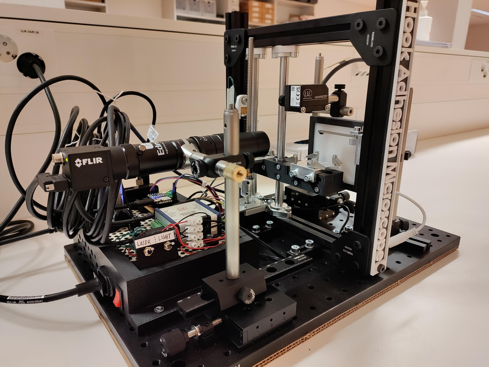
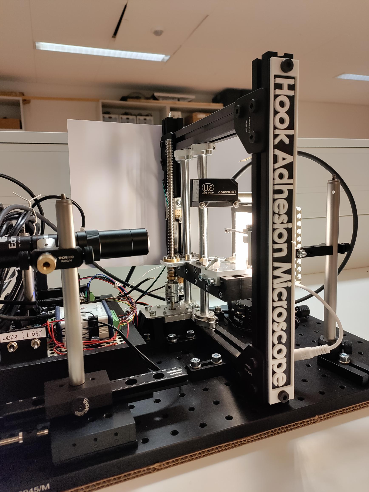

# Hook adhesion microscope
> Valtteri Turkki, 2026, Aalto University

*This repo contains mechanical design and control software for hook adhesion microscope (HAM). It is a simple cantilever force sensor system that allows measuring the adhesion force of hook-and-loop type fasteners (Velcro) and imaging the separation process as shown in the snapshot below. The setup has been developed for course **PHYS-E0411 Advanced Physics Laboratory** as a new lab exercise.*  

    
    <figcaption> <b>Figure 1:</b> <i>Snapshot from a measurement process in which two hooks were successfully attached to loops and separated.</i> </figcaption>

## Scientific background

Adhesion is defined as the attraction between two different types of surfaces, bodies or particles. Thus, it occurs at an interface between them. This is different from cohesion, where the particles are of similar type. Typically, adhesion is divided to three categories: chemical, physical and mechanical adhesion.[1] 

Hook-and-loop fasteners fall to the category of mechanical adhesion as the adhesion force is achieved by interlocking hooks to loops as seen in Figure 1. This kind of fastener is an example of nature-inspired solution as similar structures are found in plant hooks.[2] The magnitude of the adhesion force depends on a number of parameter including the material properties and the geometry of the hook, the number of hooks and the density of loops.

The reason why hook-and-loop fasteners were chosen for this lab exercise is that they offer a simple, but yet diverse system for studying adhesion forces: One can start from observing the deformation of a single hook during the separation process and then move on to studying the contact of multiple hooks. Using multiple hooks introduces a probabilistic component enabling more complex studies of the attachment.

### Pedagogical implementation

This experiment was taught as a lab exercise in spring 2026. The lab time was split to two 3h long sessions (with approx. 1 week gap between them) during which the students got to familiarize themselves with the measurement process, prepare their own samples and cantilever and finally perform measurements according to their own hypothesis. Despite having a final report, the grading of the lab exercise was not fully summative as there were intermediate submissions and participation component in the grading.

## Measurement setup

### Hardware design

To perform adhesion force measurements, one needs a setup that has at least
1. Force sensor with interchangeable probe head
2. Motorized z-axis sample stage
3. Camera, lens and a light source for imaging the system (optional)  

The above basic requirements in mind, the mechanical side of HAM (pictures in Figure 2) was designed to be such that it uses a laser displacement sensor (Micro-Epsilon OptoNCDT 1220-10) to measure deflection of a steel cantilever. The laser sensor is mounted using Thorlabs optical posts to allow flexible positioning. The base of the posts is fixed on a xy micrometer translational stage to allow precise positioning of the laser point on the cantilever.  
The z-axis motion is done with a NEMA 17 stepper motor connected to a 2 mm pitch T8 leadscrew. A anti-backlash nut is used to connect the leadscrew to the sample stage, which moves along two 12 mm rods on linear bearings. The sample stage is 3D printed from PLA, but the leadscrew nut connection and the sample holder part are machined from aluminum. The frame for the z-axis stage is made from Thorlabs 25 mm optical rails and the cantilever mount, machined from aluminum, is also attached to this frame.  
The imaging system uses a variable magnification lens (Edmund Optics VZM 200i) combined with a small semi-high frame rate camera (FLIR Blackfly S, BFS-U3-04S2M-C). The camera is mounted on optical posts allowing quick and easy positioning, but the focus direction has also a micrometer stage for improved precision. The light source is self-made using 24 V led strip.

The electronics consists of a 24 V switching mode power supply (Meanwell LRS-50-24), a USB breakout (Micro-Epsilon IF2001/USB), a stepper motor driver (Trinamic TMC2209 v2), a microcontroller (Seeeduino XIAO) and power switches. The power supply produces 24 V DC for the light source, laser sensor and the stepper motor. The laser sensor USB breakout converts RS422 line to USB and the microcontroller is used to control the stepper driver via USB serial. The camera, laser sensor and microcontroller are connected to a USB3.1 hub, which means that only one USB cable is required between the setup and the computer running the control software.

    

### Software implementation

The control software has been implemented using `python` (excluding for the microcontroller part that has made with `adruino/c++`). Each hardware component has its own class, which wraps the manufacturer SDK* (for laser sensor and camera) and provides non-blocking commands for controlling these. The measurement sequence is implemented in class `measurement.py`. The graphical user-interface is implemented using `tkinter` under `main_gui.py`. Figure 3 shows the simple graphical user-interface in action.

    
    <figcaption> <b>Figure 3:</b> <i>Screenshot of the HAM control software graphical user-interface. The system is performing automatically repeated measurements (video saving in progress after 1st measurement). </i> </figcaption>

\* Required manufacturer SDKs:  
- FLIR Spinnaker SDK [https://www.teledynevisionsolutions.com/en-150/products/spinnaker-sdk/](https://www.teledynevisionsolutions.com/en-150/products/spinnaker-sdk/)
- Micro-Epsilon MEDAQLib [https://www.micro-epsilon.com/service/software-sensorintegration/medaqlib/](https://www.micro-epsilon.com/service/software-sensorintegration/medaqlib/)

### Photos

    
    

    
    

## References

[1] L. Jeffries and D. Lentink, “Design principles and function of mechanical fasteners in nature and technology,” *Applied Mechanics Reviews*, vol. 72, no. 5, p. 050 802, 2020.  
[2] E. Gorb, V. Popov, and S. Gorb, “Natural hook-and-loop fasteners: Anatomy, mechanical properties, and attachment force of the jointed hooks of the galium aparine fruit,” *WIT Transactions on Ecology and the Environment*, vol. 57, 2002.

## ToDo log (26/06/2026)
1. Find out where the lag in measurement starting comes from
2. Implement a button that allows disabling the camera recording for storage space saving
3. Fix save file units to mm (not µm)
