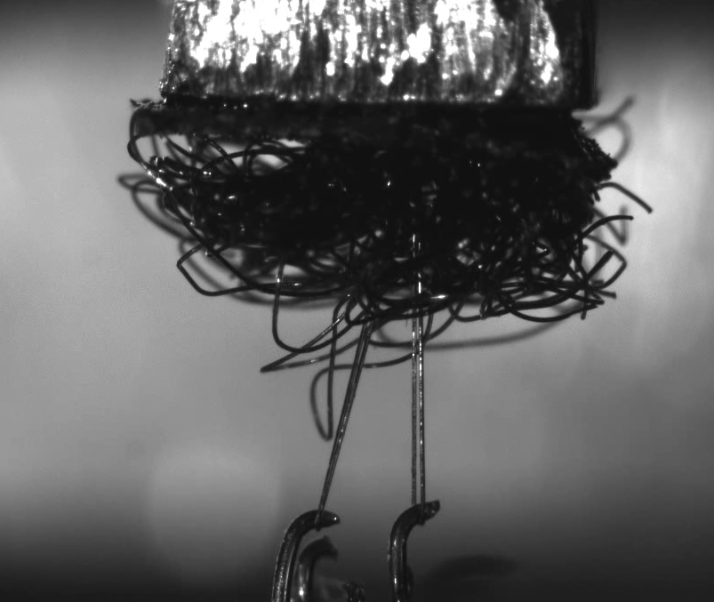

# Hook adhesion microscope
> Valtteri Turkki, 2026

## Introduction

This repo contains mechanical design and control software for hook adhesion microscope (HAM). It is a simple cantilever force sensor system that allows measuring the adhesion force of hook and loop fasteners (Velcro) and imaging the separation process as shown in the snapshot below. The setup has been developed for course *PHYS-E0411 Advanced Physics Laboratory* as a new lab exercise.

    

## Scientific background

## Measurement setup

### Hardware design

    

### Software implementation

## ToDo log
1. Find out where the lag in measurement starting comes from
